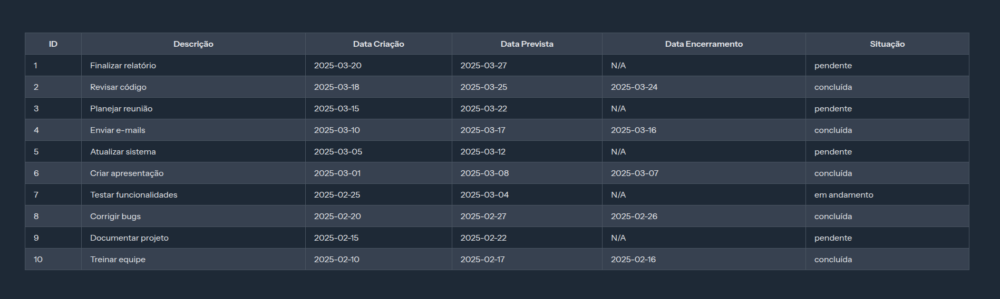

# Task 2

**Aluno**: Kauan Morinel Calheiro
**Data**: 27/03/2025

## Aplicação

### Número de classes da aplicação

As classes da aplicação e suas respectivas funções são as seguintes:

- **app/Models/Tarefa.php**: Representa o modelo da aplicação, responsável por interagir com a tabela `tarefas` no banco de dados.
- **app/Http/Controllers/TarefaController.php**: Controlador responsável por gerenciar as requisições relacionadas às tarefas, como listagem.
- **database/seeders/DatabaseSeeder.php**: Classe utilizada para popular o banco de dados com dados iniciais.
- **database/migrations/2025_03_27_235132_create_tarefas_table.php**: Arquivo de migração que define a estrutura da tabela `tarefas` no banco de dados.
- **resources/js/pages/tarefas/index.vue**: Componente Vue.js que implementa a interface de usuário para exibir as tarefas.

### Modelagem do banco de dados

#### Estrutura da Tabela `tarefas`

A tabela `tarefas` foi criada utilizando a seguinte migration:

```php
Schema::create('tarefas', function (Blueprint $table) {
    $table->id();
    $table->text('descricao');
    $table->timestamp('data_criacao')->default(now());
    $table->timestamp('data_prevista')->nullable();
    $table->timestamp('data_encerramento')->nullable();
    $table->text('situacao')->default('pendente');
    $table->timestamps();
    $table->softDeletes();
});
```

A estrutura da tabela no banco de dados é a seguinte:

| Coluna              | Tipo      | Detalhes                               |
| ------------------- | --------- | -------------------------------------- |
| `id`                | BIGINT    | Chave primária, auto-incremento        |
| `descricao`         | TEXT      | Descrição da tarefa                    |
| `data_criacao`      | TIMESTAMP | Data de criação, valor padrão `now()`  |
| `data_prevista`     | TIMESTAMP | Data prevista, pode ser nula           |
| `data_encerramento` | TIMESTAMP | Data de encerramento, pode ser nula    |
| `situacao`          | TEXT      | Situação da tarefa, padrão `pendente`  |
| `created_at`        | TIMESTAMP | Data de criação do registro            |
| `updated_at`        | TIMESTAMP | Data de atualização do registro        |
| `deleted_at`        | TIMESTAMP | Data de exclusão lógica, pode ser nula |

### Interface desenvolvida



## Publicação

### Acesso à VM

```bash
 ssh univates@177.44.248.68
```

### Instalação de cada ferramenta

#### Instalação do PHP

**Veio pré-instalado na VM**

#### Instalação do Composer

```bash
sudo apt update
sudo apt install php-cli unzip

cd ~
curl -sS https://getcomposer.org/installer -o composer-setup.php

HASH=`curl -sS https://composer.github.io/installer.sig`

php -r "if (hash_file('SHA384', 'composer-setup.php') === '$HASH') { echo 'Installer verified'; } else { echo 'Installer corrupt'; unlink('composer-setup.php'); } echo PHP_EOL;"

sudo php composer-setup.php --install-dir=/usr/local/bin --filename=composer
```

#### Instalação do Docker

```bash
sudo apt update

sudo apt install apt-transport-https ca-certificates curl software-properties-common

curl -fsSL https://download.docker.com/linux/ubuntu/gpg | sudo apt-key add -

sudo add-apt-repository "deb [arch=amd64] https://download.docker.com/linux/ubuntu focal stable"

apt-cache policy docker-ce

sudo apt install docker-ce

sudo systemctl status docker # Verificar se o serviço está rodando
```

## Implantação da aplicação

```bash
# Clonar o repositório
git clone https://github.com/KauanCalheiro/task_2.git

cd task_2

# Copiar o arquivo .env.example para .env
cp .env.example .env

# Instalar as dependências
composer install

npm install

npm run build

php artisan key:generate

composer require laravel/sail --dev

php artisan sail:install

./vendor/bin/sail up -d

./vendor/bin/sail artisan migrate

./vendor/bin/sail artisan db:seed
```

### URL de acesso

http://177.44.248.68

## Tempos

- Desenvolvimento da aplicação: 38 min

- Criação do ambiente na VM: 7 min

- Publicação da aplicação: 93 min

- Publicação da aplicação(sem considerar erros): 14 min

---

**Link do repositório**: https://github.com/KauanCalheiro/task_2.git